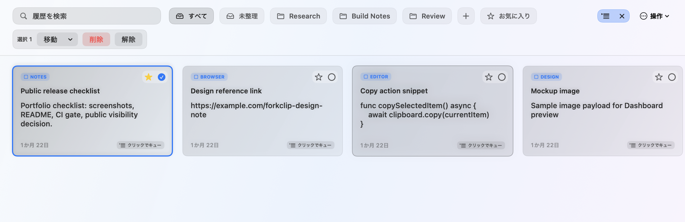
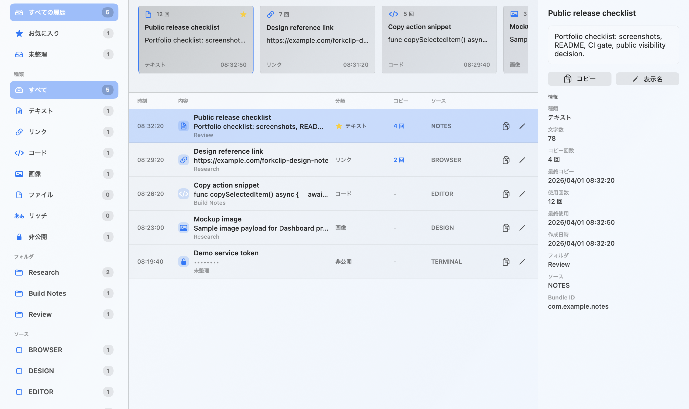
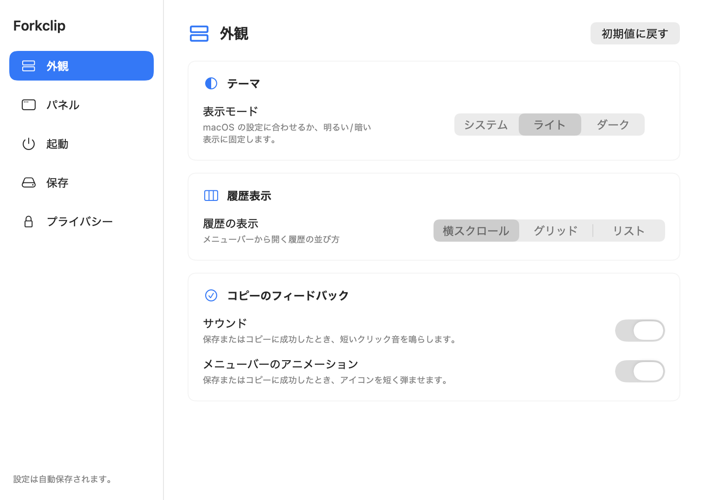

# Forkclip

[](https://github.com/wagahai-nekojita/forkclip/actions/workflows/ci.yml)

Forkclip is a local-first macOS menu bar clipboard manager built as a portfolio-grade source project. It keeps recent clipboard items close to the menu bar, gives larger history work its own Dashboard, and keeps clipboard contents on the user's Mac.

This repository is a **Portfolio Hero Repository**: it is meant to show product judgment, visible macOS craft, and the technical decisions behind a privacy-sensitive desktop app. It is still a source portfolio, not a public app download channel. Prebuilt app downloads are not provided at this stage, and the app is not currently signed or notarized for public distribution.

## Screenshots

| Quick Panel | Dashboard | Settings |
| --- | --- | --- |
|  |  |  |
| Fast access to recent clipboard history from the menu bar. | A larger space to search, inspect, organize, and reuse history. | User control over behavior, privacy, retention, and local preferences. |

Screenshots use synthetic sample data only.

## What Makes This Representative

Forkclip is the project I would put first for a non-engineer reviewer or an early-stage AI-driven developer because it shows three things at once:

- **A finished-feeling macOS native experience.** Forkclip is not just a command-line demo or prototype screen. It has a menu bar Quick Panel, Dashboard, Settings, About, app refresh scripts, local docs, and native macOS behaviors that have to work together.
- **Careful handling of sensitive clipboard data.** Clipboard history is useful precisely because it touches private material. Forkclip treats that as a core design constraint with local storage, encrypted payloads, Keychain-backed key storage, Private Mode, app blacklisting, concealed pasteboard handling, and secret-like preview masking.
- **Human-owned judgment in an AI-assisted workflow.** AI helped accelerate investigation, drafting, implementation, and review preparation, but the work is bounded by scoped Issues, ADRs, explicit validation, public distribution caveats, and human decisions about what not to ship yet.

## What Was Hard

- **The clipboard is more than text.** A single copy action can contain plain text, URL text, file URLs, RTF, HTML, and image data. Forkclip stores typed payloads so it can preserve useful representations without saving unknown raw pasteboard data blindly.
- **Privacy and convenience pull against each other.** A clipboard manager should be fast, but it should not casually expose secrets. Forkclip encrypts saved content, keeps only limited queryable metadata, hides likely-secret previews, and provides user-facing controls for private capture behavior.
- **Native macOS apps cross framework boundaries.** SwiftUI is used for app surfaces, while AppKit owns the menu bar item, panels, windows, pasteboard integration, focus behavior, and Accessibility-dependent Auto Paste path.
- **Validation has real boundaries.** Public CI can prove that source builds and tests run, but it does not prove clipboard-writing smoke behavior, native UI smoke behavior, signing, notarization, packaging, or public install readiness. The docs call those limits out instead of implying release readiness.
- **Good AI-driven development needs brakes.** The project records architecture decisions, non-goals, validation evidence, and deferred hardening work so the repository shows judgment, not just generated output.

## Why This Exists

Clipboard history is useful, but clipboard data is often sensitive. Forkclip explores a personal productivity tool that keeps history local, supports more than plain text, and makes privacy boundaries visible through local encryption, private mode, app blacklisting, diagnostics, and explicit release caveats.

## Features

- Menu bar quick panel with horizontal, grid, and list layouts.
- Global Quick Panel hotkey with visible registration status.
- Dashboard window for dense browsing, filtering, inspection, and copy reuse.
- Clipboard capture for plain text, URL text, file URLs, RTF, HTML, and common image payloads.
- Search, source-app filtering, folders, Queue mode, and Quick/Favorite retention protection.
- Auto Paste that copies first, then attempts to paste back into the previously active app when macOS Accessibility permission allows it.
- Private mode to temporarily stop saving new clipboard changes.
- Local encrypted SQLite persistence with a Keychain-backed symmetric key.
- Likely-secret masking, app blacklist, concealed pasteboard marker handling, diagnostics, and recovery copy.
- Settings for layout, panel placement, Quick Panel hotkey status, retention, startup behavior, feedback, and privacy.

## Tech Stack

- Swift 6.2 package executable
- SwiftUI for app views and settings surfaces
- AppKit for menu bar integration, `NSPanel`, `NSWindow`, `NSPasteboard`, and native macOS behaviors
- SQLite via `SQLite.swift`
- CryptoKit AES-GCM for application-layer payload encryption
- macOS Keychain for local key storage
- GitHub Actions for portfolio source build/test validation

## Architecture Notes

Forkclip separates clipboard capture, persistence, privacy checks, and UI state so the menu bar panel and Dashboard can share the same local history model.

- App shell: SwiftUI app lifecycle with an AppKit delegate, menu bar status item, quick panel, Dashboard, Settings, and About windows.
- Clipboard pipeline: `NSPasteboard` capture, type classification, privacy filtering, encrypted persistence, copy-back, and optional Auto Paste.
- Persistence: SQLite schema migrations with item rows, typed payload rows, folder metadata, retention policy, and diagnostics.
- Privacy boundary: clipboard content stays local; payload bytes and display titles are encrypted before persistence; queryable metadata is intentionally limited.

See [Architecture](docs/architecture.md) for the system map and [Architecture Decision Records](docs/adr/README.md) for decision history.

## Build And Test

Requirements:

- macOS 12 or later
- Swift toolchain compatible with `swift-tools-version: 6.2`
- Command Line Tools or Xcode

Build:

```sh
cd Forkclip
env CLANG_MODULE_CACHE_PATH=/tmp/clang-module-cache SWIFTPM_ENABLE_PLUGINS=0 \
  swift build --scratch-path /tmp/forkclip-validation-build
```

Test:

```sh
cd Forkclip
env CLANG_MODULE_CACHE_PATH=/tmp/clang-module-cache SWIFTPM_ENABLE_PLUGINS=0 \
  swift test --scratch-path /tmp/forkclip-validation-test-build
```

With Command Line Tools only, `swift test` may act as a test-target compile check. For explicit XCTest execution, run from the repository root on a machine with full Xcode:

```sh
Forkclip/scripts/run-xcode-tests.sh
```

## Run Locally

The app bundle refresh script builds the package, creates or refreshes `Forkclip.app`, bundles user docs and assets, can update `/Applications/Forkclip.app`, launches the app, and runs local smoke checks:

```sh
Forkclip/scripts/build-and-refresh-app.sh
```

For a refresh without launching the app or writing smoke-test clipboard data:

```sh
LAUNCH_APP=0 RUN_SMOKE=0 Forkclip/scripts/build-and-refresh-app.sh
```

Auto Paste requires macOS Accessibility permission for the exact app bundle that is running. Local development builds are ad hoc signed by default, so rebuilding can require refreshing the Accessibility entry.

## Documentation

- [Architecture](docs/architecture.md)
- [Development Process](docs/development-process.md)
- [ADR Index](docs/adr/README.md)
- [Getting Started](docs/user/getting-started.md)
- [Settings](docs/user/settings.md)
- [History and Folders](docs/user/history-and-folders.md)
- [Privacy and Storage](docs/user/privacy-and-storage.md)
- [Build and Run](docs/developer/build-and-run.md)
- [Validation](docs/developer/validation.md)
- [Release Notes](docs/developer/release-notes.md)
- [Portfolio Package Notes](docs/portfolio-package.md)

The app UI and bundled user-facing documentation are currently Japanese. Technical documentation in this portfolio repository is written in English for broader reviewability.

## Development Process

Forkclip was built with an AI-assisted, human-owned engineering workflow. Issues define scope, ADRs capture durable design decisions, validation commands are reported explicitly, and AI-generated suggestions are reviewed, integrated, and constrained by human judgment.

See [Development Process](docs/development-process.md).

## Distribution Status

This repository is for source review and portfolio evaluation.

- No prebuilt `.zip` or `.dmg` downloads are provided.
- No GitHub Release artifacts are provided.
- The app is not currently signed or notarized for public distribution.
- GitHub Actions validates source build/test behavior only; it does not prove app bundle refresh, clipboard-writing smoke tests, native UI smoke, signing, notarization, packaging, or install verification.
- Public app distribution remains blocked on the hardening work listed in [ADR 0010](docs/adr/0010-public-app-distribution-hardening-blockers.md).

## License

MIT License. See [LICENSE](LICENSE).

## Security

Forkclip handles clipboard history, local encryption, and Keychain-backed storage. Do not report security vulnerabilities through public GitHub Issues. See [SECURITY.md](SECURITY.md).
